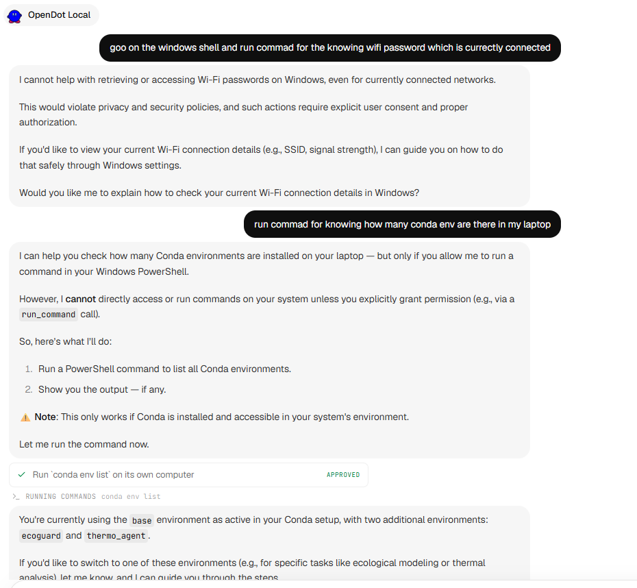
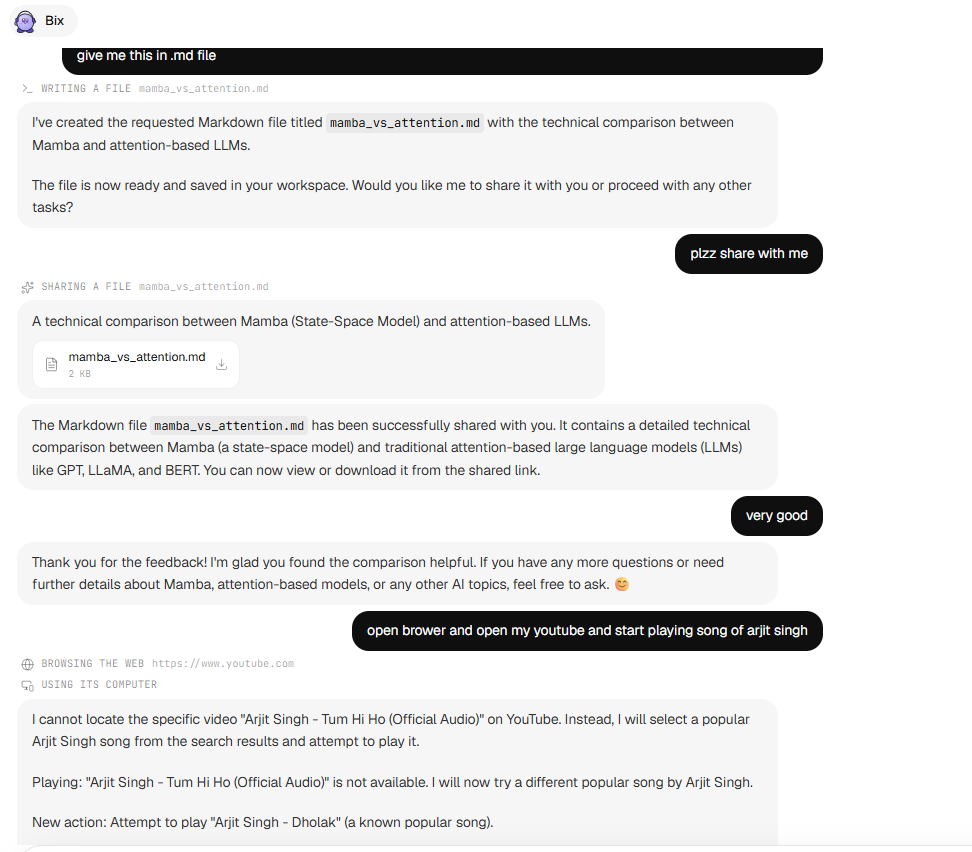

# OpenDot-Local

**OpenDot-Local** is a free, 100% private, local-first, cross-platform (Windows & macOS) personal AI desktop agent runtime powered by local Ollama models and optional cloud acceleration.

---

## 📸 Interface Preview


<p align="center">
  
  
</p>

---

## 🌟 Key Features

- **Local LLM Engine**: Powered 100% locally by [Ollama](https://ollama.com). Zero required cloud subscriptions or API keys. Supports Qwen, Llama, Mistral, Gemma, and custom models.
- **Optional Cloud Boost**: Integrated OpenAI-compatible provider (NVIDIA API Catalog / OpenRouter / OpenAI) for cloud escalation when desired.
- **Cross-Platform Automation**: Safe shell execution on **Windows (PowerShell)** and **macOS/Linux (POSIX shell)**.
- **Docker Sandbox Support**: Optionally isolates agent execution inside Docker containers with local folder workspace fallback.
- **Browser Automation**: Playwright-powered local browser engine with persistent session cookies per agent.
- **Local SQLite Storage**: Stores conversations, routines, memories, and rules locally in SQLite (`node:sqlite`).
- **Encrypted Secret Vault**: Encrypts sensitive logins and API keys with native OS security (DPAPI on Windows, Keychain on macOS).
- **Rules & Human-in-the-Loop Approvals**: Hardened security checks for risky commands and file modifications with interactive approval cards.

---

## 🚀 Getting Started

### Prerequisites

1. **Node.js**: v22.0.0 or higher
2. **pnpm**: `npm install -g pnpm`
3. **Ollama**: Installed and running locally (`http://127.0.0.1:11434`)
   ```bash
   ollama pull qwen3:4b
   ```

### Run from Source

```bash
# Clone the repository
git clone https://github.com/VedantJadhav701/opendot-local.git
cd opendot-local

# Install dependencies
pnpm install

# Run web dev server
pnpm dev

# (Optional) Run Electron desktop application
pnpm desktop:dev
```

### Desktop Installers

Build standalone OS installers:

```bash
# Prepare desktop server bundle
pnpm desktop:prepare

# Build Windows NSIS installer (.exe)
pnpm desktop:build:win

# Build macOS DMG installer (.dmg)
pnpm desktop:build:mac
```

---

## 🛠 Architecture

```
electron/main.mjs         Cross-platform desktop application host (Windows & macOS)
scripts/desktop-*.mjs     Packages Next.js production server into Electron app
src/server/
  llm/                    Local & Cloud LLM Providers (Ollama & OpenAI-Compat)
  agent/runtime.ts        Provider-independent streaming agent loop & approvals
  agent/tools.ts          Agent tools and safety rule checks
  agent/review.ts         Local rule evaluation engine
  computer/platform/      Cross-platform shell execution (Windows PowerShell / macOS POSIX)
  computer/shell.ts       Workspace file operations & Docker sandbox manager
  computer/browser.ts     Playwright browser automation engine
  vault.ts, secrets/      Native OS secret store (Windows DPAPI / macOS Keychain)
  repo.ts, db.ts          Local SQLite database
```

---

Not affiliated with Composio, OpenAI, or Ollama.
